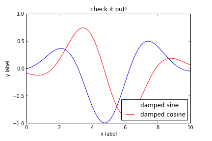
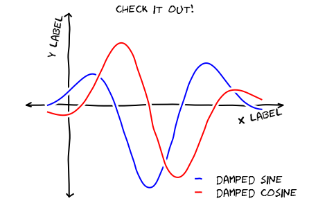

# XKCD plots in Matplotlib

This notebook originally appeared as a blog post at [Pythonic Perambulations](http://jakevdp.github.com/blog/2012/10/07/xkcd-style-plots-in-matplotlib/) by Jake Vanderplas.

<!-- PELICAN_BEGIN_SUMMARY -->
*Update: the matplotlib pull request has been merged!  See*
[*This post*](http://jakevdp.github.io/blog/2013/07/10/XKCD-plots-in-matplotlib/)
*for a description of the XKCD functionality now built-in to matplotlib!*

One of the problems I've had with typical matplotlib figures is that everything in them is so precise, so perfect.  For an example of what I mean, take a look at this figure:

    

    

Sometimes when showing schematic plots, this is the type of figure I want to display.  But drawing it by hand is a pain: I'd rather just use matplotlib.  The problem is, matplotlib is a bit too precise.  Attempting to duplicate this figure in matplotlib leads to something like this:
<!-- PELICAN_END_SUMMARY -->

    

    

It just doesn't have the same effect.  Matplotlib is great for scientific plots, but sometimes you don't want to be so precise.

This subject has recently come up on the matplotlib mailing list, and started some interesting discussions.
As near as I can tell, this started with a thread on a
[mathematica list](http://mathematica.stackexchange.com/questions/11350/xkcd-style-graphs)
which prompted a thread on the [matplotlib list](http://matplotlib.1069221.n5.nabble.com/XKCD-style-graphs-td39226.html)
wondering if the same could be done in matplotlib.

Damon McDougall offered a quick
[solution](http://www.mail-archive.com/matplotlib-users@lists.sourceforge.net/msg25499.html)
which was improved by Fernando Perez in [this notebook](http://nbviewer.ipython.org/3835181/), and
within a few days there was a [matplotlib pull request](https://github.com/matplotlib/matplotlib/pull/1329) offering a very general
way to create sketch-style plots in matplotlib.  Only a few days from a cool idea to a
working implementation: this is one of the most incredible aspects of package development on github.

The pull request looks really nice, but will likely not be included in a released version of
matplotlib until at least version 1.3.  In the mean-time, I wanted a way to play around with
these types of plots in a way that is compatible with the current release of matplotlib.  To do that,
I created the following code:

## The Code: XKCDify

XKCDify will take a matplotlib ``Axes`` instance, and modify the plot elements in-place to make
them look hand-drawn.
First off, we'll need to make sure we have the Humor Sans font.
It can be downloaded using the command below.

Next we'll create a function ``xkcd_line`` to add jitter to lines.  We want this to be very general, so
we'll normalize the size of the lines, and use a low-pass filter to add correlated noise, perpendicular
to the direction of the line.  There are a few parameters for this filter that can be tweaked to
customize the appearance of the jitter.

Finally, we'll create a function which accepts a matplotlib axis, and calls ``xkcd_line`` on
all lines in the axis.  Additionally, we'll switch the font of all text in the axes, and add
some background lines for a nice effect where lines cross.  We'll also draw axes, and move the
axes labels and titles to the appropriate location.

## Testing it Out

Let's test this out with a simple plot.  We'll plot two curves, add some labels,
and then call ``XKCDify`` on the axis.  I think the results are pretty nice!

    
    Welcome to pylab, a matplotlib-based Python environment [backend: module://IPython.zmq.pylab.backend_inline].
    For more information, type 'help(pylab)'.

    <matplotlib.axes.AxesSubplot at 0x2fecbd0>

    

    

## Duplicating an XKCD Comic

Now let's see if we can use this to replicated an XKCD comic in matplotlib.
This is a good one:

    

    

With the new ``XKCDify`` function, this is relatively easy to replicate.  The results
are not exactly identical, but I think it definitely gets the point across!

    <matplotlib.axes.AxesSubplot at 0x2fef210>

    

    

Pretty good for a couple hours's work!

I think the possibilities here are pretty limitless: this is going to be a hugely
useful and popular feature in matplotlib, especially when the sketch artist PR is mature
and part of the main package.  I imagine using this style of plot for schematic figures
in presentations where the normal crisp matplotlib lines look a bit too "scientific".
I'm giving a few talks at the end of the month... maybe I'll even use some of
this code there.

This post was written entirely in an IPython Notebook: the notebook file is available for
download [here](http://jakevdp.github.com/downloads/notebooks/XKCD_plots.ipynb).
For more information on blogging with notebooks in octopress, see my
[previous post](http://jakevdp.github.com/blog/2012/10/04/blogging-with-ipython/)
on the subject.
